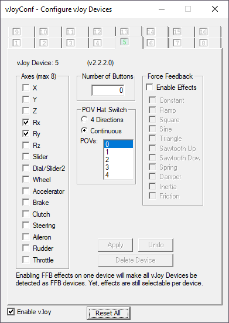

PedalPal
========

This app relies on vJoy, which can be downloaded here: https://github.com/BrunnerInnovation/vJoy/releases
vJoy is a virtual joystick driver that allows you to create virtual joysticks and send input to them. It is used by many applications, including games and simulators, to provide additional input devices.

Install vJoy, open "Configure vJoy", and create a virtual joystick with the following settings:
- RX
- RY

E.g. in case you are using vJoy controller 5:

Exchange your IP address with your PAL, enter it, and press start. You should see your inputs on their screen and vice versa.

To see their game, use Steam's screen sharing feature. It's the one with the lowest latency.

Icon by <a href="https://www.flaticon.com/free-icons/pedal" title="pedal icons">Pedal icons created by Freepik - Flaticon</a>