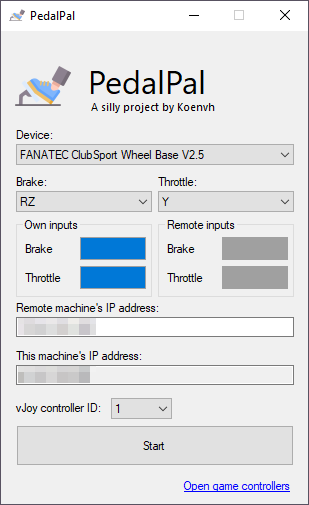

PedalPal
========

This app relies on vJoy, which can be downloaded here: https://github.com/BrunnerInnovation/vJoy/releases  
vJoy is a virtual joystick driver that allows you to create virtual joysticks and send input to them. 

Install vJoy, open "Configure vJoy", and create a virtual joystick with the following settings:
- RX
- RY

E.g. in case you are using vJoy controller 5:

Exchange your IP address with your friend, enter it under "Remote machine's IP address", and press start. Make sure your friend does this as well. You should see your inputs on their screen and vice versa.

To see their game, use Steam's screen sharing feature or [Parsec](https://parsec.app/). That reduces latency.

If the connection does not work, check your firewall settings. You may need to allow the app through your firewall. If it does not work, try [ZeroTier](https://www.zerotier.com/pricing/) or port forward port 53544 over UDP.

Icon by <a href="https://www.flaticon.com/free-icons/pedal" title="pedal icons">Pedal icons created by Freepik - Flaticon</a>